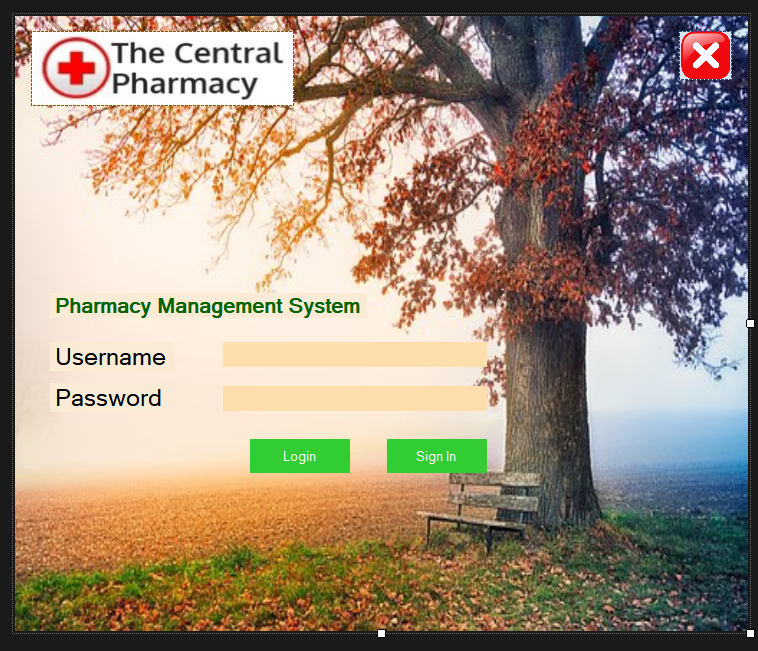
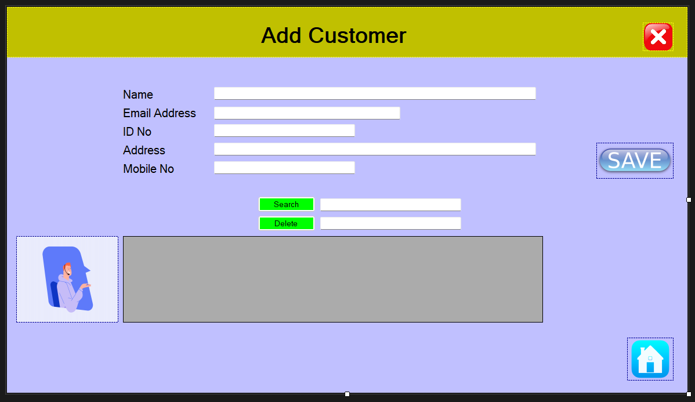
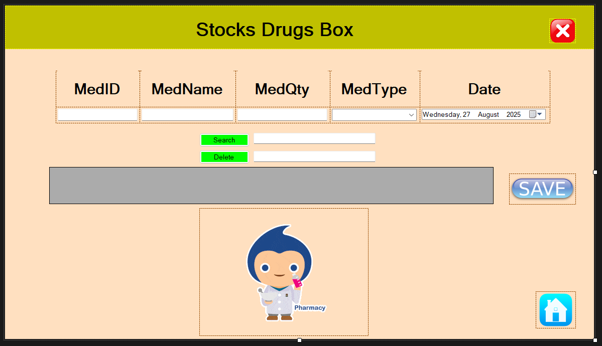

# Pharmacy Management System — C# .NET (WinForms + SQL Server)

A desktop application to manage pharmacy inventory, billing, customers, and suppliers.

✨ Features
- Inventory management 
- Customer & supplier management
- Billing & invoicing with tax/discount
- Role-based login system
- Reports: daily sales, stock summary, purchase summary

🛠 Tech Stack
- C#, .NET Framework (WinForms)
- SQL Server (ADO.NET)
- Visual Studio

🚀 How to Run
1. Clone or download this repo
2. Open `.sln` file in Visual Studio
3. Restore the database (`.bak` or `.sql` if provided)
4. Update connection string in `App.config`
5. Build & Run

 📷 Screenshots

 Login Form

 Customer

 Inventory Management

